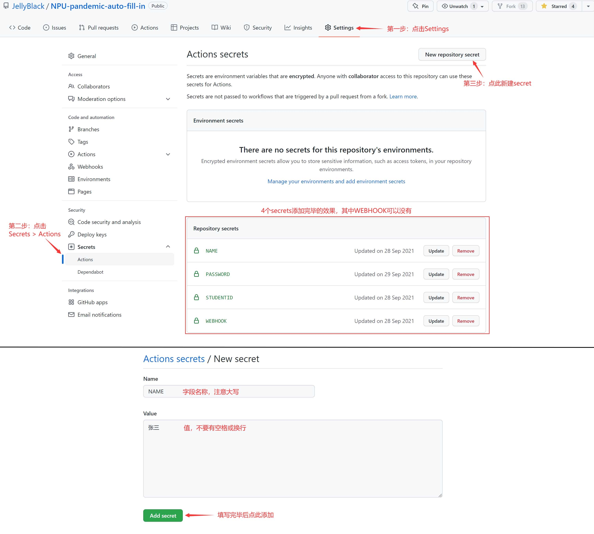
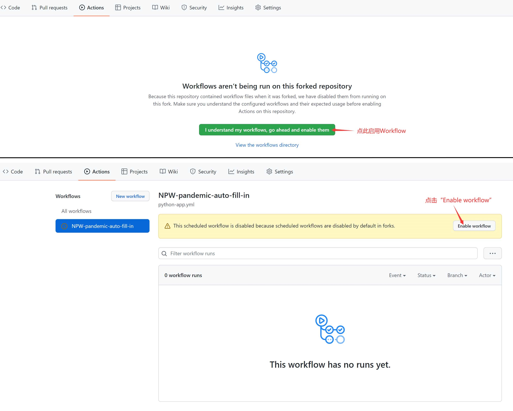

# NPU-pandemic-auto-fill-in

西北工业大学疫情自动填报Python脚本

## 免责声明

本脚本专为懒人准备，不代表校方观点。若出现填报失败、填报错误、被后台识别等，开发者不负任何责任。使用此脚本则表示你已阅读并同意以上免责声明。

## 脚本说明

该脚本在每天5:34和9:34（北京时间）自动填报，可能会稍晚数分钟甚至一个多小时。填报两次是为了确保填报成功。你可以修改yml文件里的cron表达式来修改执行时间。

该脚本自动填报的信息如下：

- 当前所在位置：在学校
- 今天的体温范围：37.3度以下
- 您有无疑似症状：无
- 西安市一码通状态：绿码
- 其他情况说明：（空）

注意：若仓库60天无活动，GitHub将自动停止Action。停止前7天GitHub将向你的注册邮箱发送邮件，前往邮件按提示操作即可恢复。

## 食用方法

1. **Fork该仓库（点右上角从左到右第二个按钮）**

   ~~当然给个三连也行~~

1. **进入Fork的仓库，点Settings>Secrets，添加以下秘密信息。**

   | 名称（大写） | 说明                    | 示例           |
   | ------------ | ----------------------- | -------------- |
   | NAME         | 你的名字（君の名は）    | 张三           |
   | STUDENTID    | 你的学号                | 2021300001     |
   | PASSWORD     | 你翱翔门户的密码        | 123456         |
   | WEBHOOK      | 钉钉Webhook地址（可选） | https://...... |

   

   其中WEBHOOK用于向钉钉群聊发送填报通知，如需要使用此功能，可访问[官方文档](https://open.dingtalk.com/document/group/custom-robot-access)配置。安全关键词填写“疫情自动填报”。若填“填报失败”则只接收填报失败的通知。

   不需要接收填报通知，则无需创建该字段。

2. **进入Actions页面，启用Workflow。**

   

## 注意事项

1. 如果你更改了密码，请务必更新Settings>Secrets里的PASSWORD为你修改后的密码，否则会填报失败。
2. 如果你被辅导员请去喝茶，请不要提及此脚本。否则若学生用脚本自动填报一事被发现，会威胁广大同胞的人身安全。

## 更新日志
**2022年4月17日**

添加了图片引导，修正一些小错误。

**2021年12月23日**

疫情填报系统更新，部分字段调整，并加上了签名校验。填报时如果不带签名，则会发生错误，错误码为-2，错误信息为“系统已记录您的非正常操作，所有绕过系统页面正常操作以外的的行为，都将视为网络攻击行为！”。目前已紧急修复，合并一下分支即可。

## 开发者

Jelly Black

QQ:1574854804

